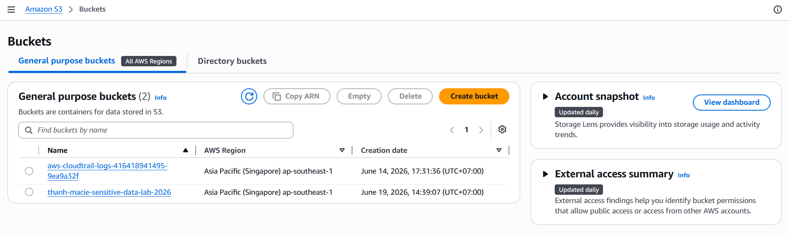
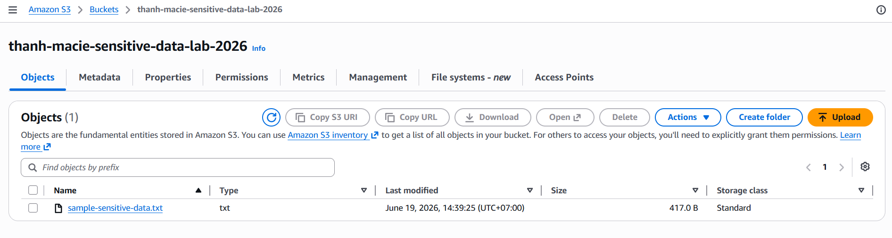
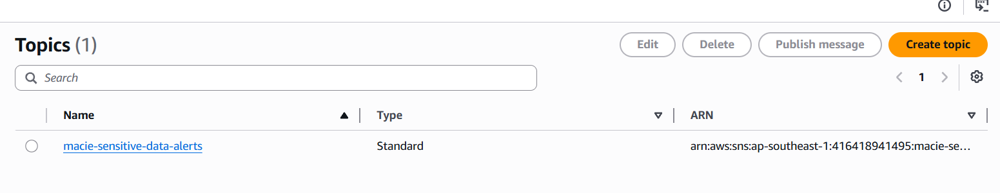
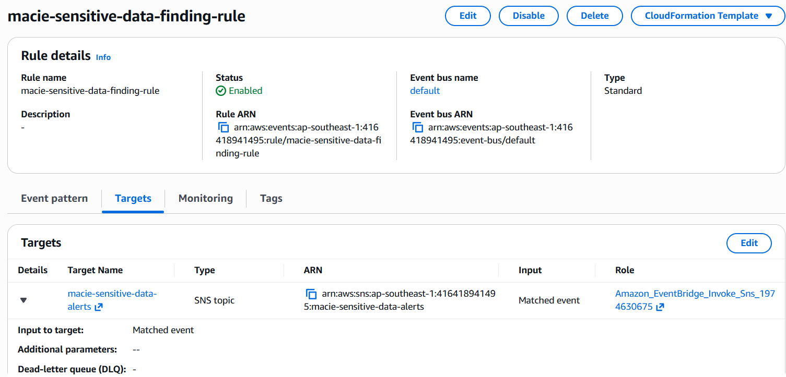
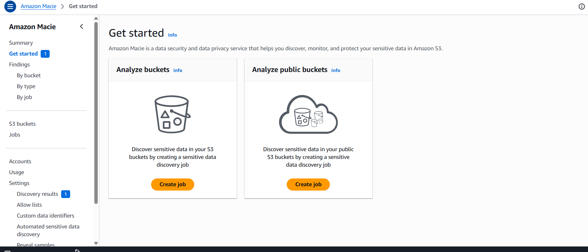
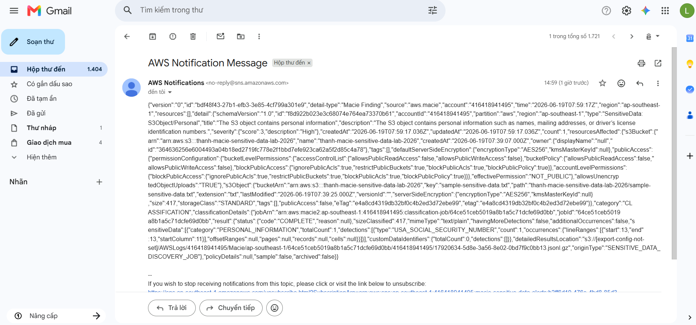

# EVIDENCE - PHÁT HIỆN DỮ LIỆU NHẠY CẢM TRONG S3 BẰNG AMAZON MACIE

## Người thực hiện

- Họ tên: Lê Nguyễn Nhật Thành
- Ngày thực hiện: 19/06/2026
- Nội dung: Hands-On Detect Sensitive Data in Amazon S3 Buckets and Send Notifications using Amazon Macie

## 1. Mục tiêu

Thiết lập Amazon Macie để phát hiện dữ liệu nhạy cảm trong Amazon S3 bucket và gửi email cảnh báo thông qua Amazon EventBridge và Amazon SNS.

Luồng hoạt động:

```text
Sample files
     ↓
Amazon S3 Bucket
     ↓
Amazon Macie Job
     ↓
Macie Finding
     ↓
Amazon EventBridge Rule
     ↓
SNS Topic
     ↓
Email Notification
```

---

## 2. Thông tin môi trường

* AWS Region: Asia Pacific (Singapore) - `ap-southeast-1`
* AWS Service: Amazon S3
* AWS Service: Amazon Macie
* AWS Service: Amazon EventBridge
* AWS Service: Amazon SNS
* S3 Bucket: `thanh-macie-sensitive-data-lab`
* Macie Job: `macie-sensitive-data-s3-job`
* EventBridge Rule: `macie-sensitive-data-finding-rule`
* SNS Topic: `macie-sensitive-data-alerts`

---

## 3. Các bước thực hiện

### Bước 1: Tạo S3 Bucket và upload sample files

Đã tạo S3 bucket dùng cho bài lab:

```text
thanh-macie-sensitive-data-lab
```

Bucket được upload file dữ liệu kiểm thử có chứa thông tin nhạy cảm giả lập như email, số điện thoại, số thẻ kiểm thử và số định danh kiểm thử.

### Minh chứng

* Screenshot S3 Bucket đã được tạo.


* Screenshot file sample đã được upload vào S3 Bucket.


---

### Bước 2: Tạo SNS Topic và Email Subscription

Đã tạo SNS Topic:

```text
macie-sensitive-data-alerts
```

Email subscription đã được tạo và xác nhận trạng thái:

```text
Confirmed
```

### Minh chứng

* Screenshot SNS Topic.


* Screenshot SNS Email Subscription đã confirmed.


---

### Bước 3: Tạo EventBridge Rule gửi cảnh báo Macie Finding

Đã tạo EventBridge Rule để bắt sự kiện Macie Finding:

```json
{
  "source": ["aws.macie"],
  "detail-type": ["Macie Finding"]
}
```

Rule được cấu hình target đến SNS Topic:

```text
macie-sensitive-data-alerts
```

Khi Macie tạo finding mới, EventBridge gửi sự kiện đến SNS và SNS gửi email cảnh báo.

### Minh chứng

* Screenshot EventBridge Rule pattern.


* Screenshot EventBridge Rule target là SNS Topic.


---

### Bước 4: Bật Amazon Macie

Đã bật Amazon Macie tại Region:

```text
Asia Pacific (Singapore) - ap-southeast-1
```

Macie đã nhận diện được S3 bucket trong tài khoản và sẵn sàng tạo sensitive data discovery job.

### Minh chứng

* Screenshot Amazon Macie đã được enabled.


---

### Bước 5: Tạo Macie Sensitive Data Discovery Job

Đã tạo Macie job để quét S3 bucket:

| Thuộc tính | Giá trị |
| --- | --- |
| Job name | `macie-sensitive-data-s3-job` |
| Job type | One-time job |
| S3 bucket | `thanh-macie-sensitive-data-lab` |
| Data identifiers | Managed data identifiers |
| Scope | Current objects in selected bucket |

Macie job được chạy để phát hiện dữ liệu nhạy cảm trong các object của S3 bucket.

### Minh chứng

* Screenshot cấu hình Macie Job.


* Screenshot Macie Job chạy thành công hoặc đã hoàn tất.


---

### Bước 6: Xác nhận Macie Findings và email cảnh báo

Sau khi job hoàn tất, Amazon Macie tạo finding cho object chứa dữ liệu nhạy cảm.

Finding ghi nhận loại dữ liệu nhạy cảm được phát hiện và S3 object liên quan. EventBridge rule bắt sự kiện Macie Finding và gửi đến SNS Topic để gửi email cảnh báo.

### Minh chứng

* Screenshot danh sách Macie Findings.


* Screenshot chi tiết Finding.


* Screenshot email cảnh báo Macie Finding nhận được từ AWS SNS.


---

## 4. Kết quả đạt được

Đã cấu hình thành công hệ thống phát hiện dữ liệu nhạy cảm trong S3 bằng Amazon Macie và gửi cảnh báo qua email.

Luồng hoạt động:

```text
Amazon S3
    ↓
Amazon Macie
    ↓
Macie Finding
    ↓
Amazon EventBridge
    ↓
Amazon SNS
    ↓
Email Notification
```

Khi Macie phát hiện dữ liệu nhạy cảm trong S3 object, hệ thống tự động tạo finding và gửi email cảnh báo đến người quản trị.

